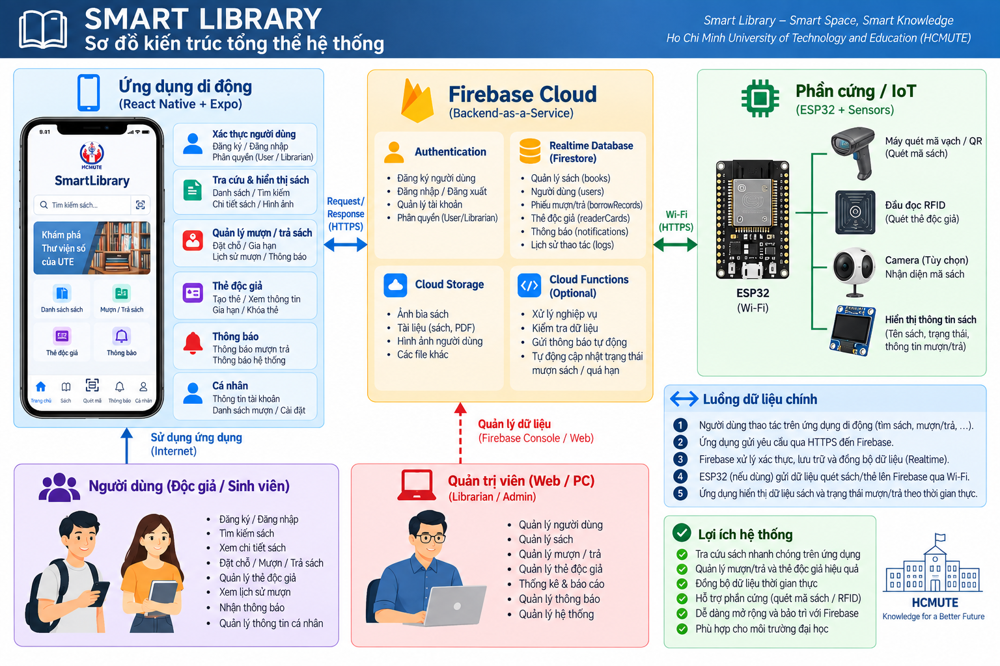

# SmartLibrary 📚

Ứng dụng quản lý thư viện trên nền tảng mobile, được xây dựng bằng **React Native + Expo + TypeScript**, kết hợp **Firebase Authentication** và **Firebase Realtime Database**.

Dự án hướng đến việc số hóa các chức năng quản lý thư viện, gồm tài khoản người dùng, tài khoản thủ thư, quản lý sách, thẻ độc giả và các chức năng quản lý mượn/trả.

---

## 🚀 Công nghệ sử dụng

- **React Native**
- **Expo**
- **TypeScript**
- **Expo Router** – điều hướng theo cấu trúc file
- **Firebase Authentication** – đăng nhập, đăng ký, phân quyền tài khoản
- **Firebase Realtime Database** – lưu trữ và đồng bộ dữ liệu
- **Git / GitHub** – quản lý mã nguồn và tiến độ
- **Expo Go** – chạy thử trong quá trình phát triển

---

## ✨ Chức năng hiện tại

### 👤 1. Tài khoản người dùng

- Đăng ký tài khoản.
- Đăng nhập.
- Đăng xuất.
- Phân biệt tài khoản **User** và **Librarian**.
- Kiểm tra trạng thái tài khoản.
- Hỗ trợ khóa/mở khóa tài khoản.
- Quên/đặt lại mật khẩu thông qua Firebase Authentication.

### 🧑‍💼 2. Tài khoản Librarian / Admin

- Đăng nhập bằng tài khoản thủ thư.
- Dashboard quản lý thư viện.
- Điều hướng giữa các nhóm chức năng quản lý.
- Quản lý tài khoản người dùng.
- Quản lý sách.
- Quản lý mượn/trả.
- Quản lý sách quá hạn.
- Quản lý thông báo/thống kê theo các module của dashboard.

### 📚 3. Quản lý sách

- Hiển thị danh sách sách.
- Tìm kiếm/tra cứu sách.
- Tra cứu theo thông tin sách như mã/ISBN khi dữ liệu có hỗ trợ.
- Hiển thị thông tin sách.
- Hỗ trợ hiển thị ảnh bìa sách.
- Quản lý dữ liệu sách từ phía Librarian.

### 🪪 4. Quản lý thẻ độc giả

Librarian có thể quản lý thẻ độc giả thông qua module **Thẻ Độc Giả**.

Các thông tin của thẻ gồm:

- Mã thẻ.
- Người dùng sở hữu thẻ.
- Email.
- Họ tên.
- Số điện thoại.
- Loại độc giả:
  - Sinh viên.
  - Giảng viên.
  - Khác.
- Ngày cấp.
- Ngày hết hạn.
- Trạng thái:
  - Đang hoạt động.
  - Đã khóa.
- Ghi chú.
- Thời gian tạo.

Các thao tác chính:

- Tạo thẻ độc giả.
- Sinh mã thẻ.
- Liên kết thẻ với tài khoản người dùng.
- Kiểm tra trùng mã thẻ.
- Khóa/mở khóa thẻ.
- Gia hạn thẻ.
- Xóa thẻ.

### 🔥 5. Firebase

Firebase được sử dụng làm nền tảng backend cho ứng dụng.

#### Firebase Authentication

Quản lý:

- Đăng ký.
- Đăng nhập.
- Đặt lại mật khẩu.
- Xác thực tài khoản.

#### Firebase Realtime Database

Các nhóm dữ liệu chính đang được sử dụng gồm:

```text
users
books
borrowRecords
readerCards
```

Dữ liệu được đọc và cập nhật theo thời gian thực để các màn hình trong ứng dụng có thể đồng bộ với Firebase.

### 🏠 6. Giao diện ứng dụng

Các màn hình/chức năng chính đã được xây dựng gồm:

- Login.
- Register.
- Home.
- Books.
- Scan/tra cứu sách.
- Librarian Dashboard.
- Quản lý sách.
- Quản lý người dùng.
- Quản lý mượn/trả.
- Quản lý thẻ độc giả.

---

# 📁 Cấu trúc dự án

Cấu trúc chính của source hiện tại:

```text
SmartLibrary/
│
├── assets/
│   └── images/
│       ├── hcmute_logo.png
│       └── book09.png
│
├── src/
│   │
│   ├── app/
│   │   ├── index.tsx
│   │   ├── register.tsx
│   │   ├── home.tsx
│   │   ├── books.tsx
│   │   ├── scan-book.tsx
│   │   └── librarian.tsx
│   │
│   ├── components/
│   │   └── admin/
│   │       ├── AdminDashboard.tsx
│   │       └── AdminCardManager.tsx
│   │
│   ├── config/
│   │   └── firebase.ts
│   │
│   └── types/
│       └── admin.ts
│
├── docs/
│   └── images/
│       └── smart-library-architecture.png
│
├── package.json
├── tsconfig.json
├── app.json
└── README.md
```

> Cấu trúc trên mô tả các module chính của ứng dụng hiện tại; các file phụ thuộc cấu hình Expo hoặc các module được bổ sung trong quá trình phát triển có thể thay đổi.

---

# 🧩 Mô tả các thư mục chính

## `src/app/`

Chứa các màn hình chính của ứng dụng và các route của Expo Router.

### `index.tsx`

Màn hình đăng nhập.

Chức năng chính:

- Nhập email/mật khẩu.
- Đăng nhập Firebase.
- Chuyển đổi tài khoản User/Librarian.
- Kiểm tra thông tin tài khoản trong Realtime Database.
- Kiểm tra trạng thái khóa tài khoản.
- Điều hướng theo quyền người dùng.

### `register.tsx`

Màn hình đăng ký tài khoản.

Hỗ trợ tạo tài khoản cho các nhóm người dùng theo phân quyền của hệ thống.

### `home.tsx`

Màn hình chính của người dùng sau khi đăng nhập.

### `books.tsx`

Màn hình tra cứu và hiển thị danh sách sách.

### `scan-book.tsx`

Module liên quan đến tra cứu/nhận diện sách bằng mã sách hoặc ISBN và hiển thị thông tin sách.

### `librarian.tsx`

Màn hình chính dành cho Librarian/Admin.

Tập trung các module quản lý:

```text
Dashboard
Books
Users
Borrows
Returns
Overdue
Notifications
Statistics
Reader Cards
```

---

# 🧱 Components

## `src/components/admin/`

Chứa các component dành cho giao diện quản trị.

### `AdminDashboard.tsx`

Dashboard của Librarian.

Cung cấp các nút truy cập nhanh đến những chức năng quản lý như:

- Quản lý sách.
- Quản lý người dùng.
- Mượn sách.
- Trả sách.
- Sách quá hạn.
- Thẻ độc giả.
- Các chức năng quản lý khác.

### `AdminCardManager.tsx`

Module quản lý **thẻ độc giả**.

Component này nhận danh sách người dùng và danh sách thẻ từ màn hình Librarian, sau đó thực hiện các thao tác tạo và quản lý ReaderCard.

---

# 🔥 Firebase Configuration

File:

```text
src/config/firebase.ts
```

Chịu trách nhiệm cấu hình và khởi tạo Firebase cho ứng dụng.

Các dịch vụ được sử dụng:

```text
Firebase Authentication
Firebase Realtime Database
```

Kiến trúc dữ liệu khái quát:

```text
Firebase
│
├── Authentication
│   └── User accounts
│
└── Realtime Database
    ├── users
    ├── books
    ├── borrowRecords
    └── readerCards
```

---

# 📝 Types

File:

```text
src/types/admin.ts
```

Chứa các kiểu dữ liệu TypeScript phục vụ module quản trị, ví dụ:

```text
UserAccount
AdminBook
AdminBorrowRecord
AppNotification
ReaderCard
```

Việc định nghĩa type giúp thống nhất cấu trúc dữ liệu giữa các component và Firebase.

---

# 🏗️ Kiến trúc tổng thể hệ thống



Luồng hoạt động tổng quát:

```text
┌─────────────────────────┐
│       Mobile App        │
│    React Native/Expo    │
└────────────┬────────────┘
             │
       ┌─────┴─────┐
       │           │
       ▼           ▼
┌────────────┐ ┌───────────────┐
│    User    │ │   Librarian   │
│ Interface  │ │    / Admin    │
└─────┬──────┘ └───────┬───────┘
      │                │
      └────────┬───────┘
               ▼
      ┌──────────────────┐
      │      Firebase    │
      │                  │
      │ Authentication   │
      │ Realtime Database│
      └────────┬─────────┘
               │
      ┌────────┴──────────┐
      │                   │
      ▼                   ▼
   User data          Library data
                      ├─ Books
                      ├─ Borrow
                      └─ Reader Cards
```

---

# ▶️ Cài đặt và chạy dự án

Clone repository:

```bash
git clone <repository-url>
cd SmartLibrary
```

Cài đặt package:

```bash
npm install
```

Chạy Expo:

```bash
npx expo start
```

Có thể sử dụng:

- Expo Go.
- Android Emulator.
- Development build.

Nếu Metro cache gây lỗi:

```bash
npx expo start -c
```

---

# 🔐 Cấu hình Firebase

Trước khi chạy ứng dụng, cần cấu hình Firebase tương ứng với project.

Các thành phần cần thiết:

```text
Firebase Authentication
Firebase Realtime Database
```

Không đưa thông tin bí mật hoặc credential nhạy cảm trực tiếp lên GitHub.

---

# 📌 Tiến độ hiện tại

### Đã triển khai

- [x] Khởi tạo Expo React Native.
- [x] Thiết lập GitHub.
- [x] Login / Register.
- [x] Phân quyền User / Librarian.
- [x] Home và navigation.
- [x] Kết nối Firebase.
- [x] Giao diện tra cứu sách.
- [x] Quản lý tài khoản.
- [x] Dashboard Librarian.
- [x] Quản lý sách.
- [x] Module thẻ độc giả.
- [x] Kết nối dữ liệu ReaderCard với Firebase.
- [x] Cấu trúc TypeScript cho module Admin.

### Đang tiếp tục hoàn thiện

- [ ] Hoàn thiện toàn bộ chức năng mượn/trả.
- [ ] Hoàn thiện kiểm thử các module.
- [ ] Tích hợp và kiểm thử phần cứng.
- [ ] Tích hợp cuối toàn hệ thống.
- [ ] Hoàn thiện báo cáo và tài liệu.
- [ ] Chuẩn bị bản demo/đóng gói ứng dụng.

---

# 👥 Phân công chính

| Thành viên | Phụ trách |
|---|---|
| TV1 | GitHub, giao diện độc giả, kiểm tra tiến độ, tích hợp cuối |
| TV2 | Tài khoản Admin và chức năng App |
| TV3 | Tài khoản Admin và chức năng App |
| TV4 | Firebase và hỗ trợ tích hợp cuối |
| TV5 | Phần cứng |
| TV6 | Báo cáo |

---

# 📄 Tài liệu

Các tài liệu, sơ đồ kiến trúc và hình ảnh minh họa được đặt trong thư mục:

```text
docs/
```

Sơ đồ kiến trúc:

```text
docs/images/smart-library-architecture.png
```
Sơ đồ kiến trúc AI dự kiến:

```text
docs/images/Mô_hình_AI_đề_xuất_sách_cho_Smart_Library.png
```